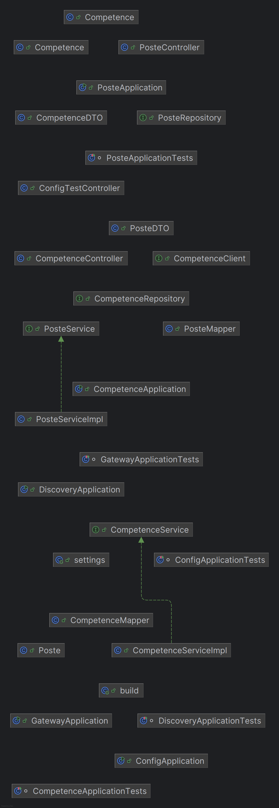

## 🏗️ Architecture mise en place

L'architecture du projet est basée sur une approche **microservices** avec les composants suivants :

- **Spring Cloud Gateway** : Sert de point d'entrée unique (API Gateway) pour router les requêtes vers les microservices.
- **Spring Cloud Eureka** : Service de découverte utilisé pour enregistrer et localiser dynamiquement les microservices.
- **Spring Cloud Config** : Fournit la configuration centralisée aux services, avec la possibilité de mise à jour dynamique grâce à `@RefreshScope`.
- **Services métiers** :
  - `COMPETENCE` : Gestion des compétences
  - `POSTE` : Gestion des postes

Tous les services sont enregistrés auprès d’Eureka et communiquent entre eux via des appels REST via la Gateway.

---



## 📌 Endpoints des services

L'ensemble des services sont accessibles via l'**API Gateway** sur le port `8888`. Le routing est effectué à partir du nom du microservice (déclaré dans `application.yml` **ou dans `application.properties`** via `spring.application.name`).

---

### 🔧 Service COMPETENCE (`spring.application.name: COMPETENCE`)

| Méthode | Endpoint via Gateway                          | Description                         |
| ------- | --------------------------------------------- | ----------------------------------- |
| GET     | `http://localhost:8888/COMPETENCE/skills`     | Récupérer toutes les compétences    |
| GET     | `http://localhost:8888/COMPETENCE/skill/{id}` | Récupérer une compétence par son ID |

---

### 🔧 Service POSTE (`spring.application.name: POSTE`)

| Méthode | Endpoint via Gateway                     | Description                   |
| ------- | ---------------------------------------- | ----------------------------- |
| GET     | `http://localhost:8888/POSTE/postes`     | Récupérer tous les postes     |
| GET     | `http://localhost:8888/POSTE/poste/{id}` | Récupérer un poste par son ID |

---

### 🔧 Service CONFIGURATION (Test de configuration dynamique)

| Méthode | Endpoint via Gateway                          | Description                                        |
| ------- | --------------------------------------------- | -------------------------------------------------- |
| GET     | `http://localhost:8888/COMPETENCE/testConfig` | Récupérer les valeurs des propriétés `a`, `c`, `p` |

> 🌀 **Note :** L’annotation `@RefreshScope` permet de rafraîchir ces propriétés dynamiquement après une mise à jour dans le **Config Server** (ex: via `curl -X POST http://localhost:8888/COMPETENCE/actuator/refresh`).  
> 🔄 Actuellement, le **hot reload** est configuré uniquement pour le service `COMPETENCE`.

---

## ▶️ Commandes pour exécuter le projet

Avant de lancer les services, assurez-vous que :

- Vous avez Java 17+ et Maven installés
- Le **Config Server**, **Eureka Discovery Server**, et **Gateway** sont bien configurés et démarrés
- Les fichiers de configuration sont disponibles dans le dépôt Git associé au Config Server

---

### 🔁 Démarrage des services

Dans chaque microservice (COMPETENCE, POSTE, etc.), exécutez :

```bash
./mvnw spring-boot:run
```

ou, si Maven est installé globalement :

```bash
mvn spring-boot:run
```

### 🔁 Démarrage avec IntelliJ / IDE

1. Ouvrir le projet dans IntelliJ
2. Lancer chaque microservice en cliquant sur le bouton "Run" du fichier principal (`@SpringBootApplication`)

---

### 🚀 Ordre de démarrage recommandé

1. `config`
2. `discovery`
3. `gateway`
4. `competence`
5. `poste`

---

## 🧪 Tests avec Bruno

Une collection de requêtes HTTP a été préparée pour tester les points d’entrée de chaque microservice ainsi que la mise à jour dynamique de la configuration.

📂 Les fichiers `.bru` sont disponibles dans le dossier `bruno/` du projet.  
✅ Ouvrir ce dossier dans [Bruno](https://www.usebruno.com/) ou [BruCLI](https://bruno.now.sh/), puis exécuter les requêtes directement.

Cela permet de :

- Récupérer les compétences ou les postes
- Tester un appel par ID
- Vérifier les valeurs de configuration
- Déclencher le rafraîchissement de la configuration à chaud